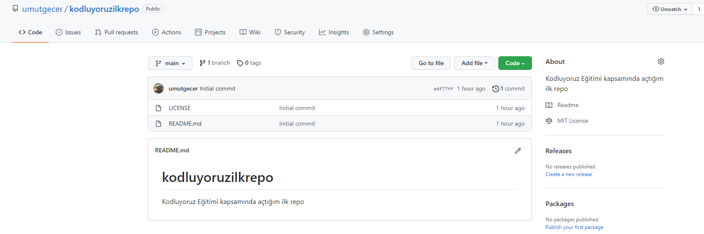

# Kodluyoruz İlk Repo

Bu repo [Kodluyoruz](https://www.kodluyoruz.org/) Front-End Eğitiminde oluşturduğumuz ilk repo. İçerisinde bir adet README dosyası, bir adet de index.html bandırıyor.

## Installation

Öncelikle projeyi klonlayın. (Buraya sizin reponuzdan aldığınız link gelecek)

```bash
git clone https://github.com/umutgecer/kodluyoruzilkrepo.git
```



## Usage 

Proje klonladıktan sonra Visual Studio Code programında açınız.

Linux için:

```bash
cd kodluyoruzilkrepo
code .
```

## Contributing

Pul requestler kabul edilir. Büyük değişiklikler için lütfen önce neyi değiştirmek istediğinizi tartışmak için bir konu açınız.

## License

[MIT](https://choosealicense.com/licenses/mit/) 


