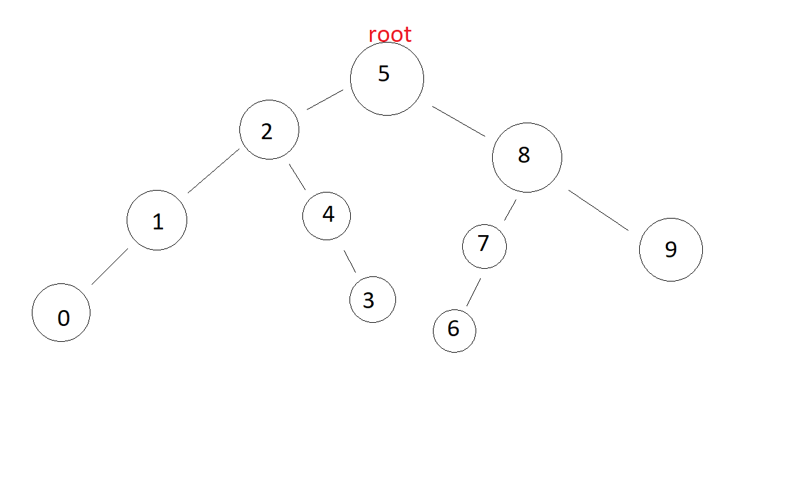

# Veri Yapıları ve Algoritmalar Modülü Proje Ödevleri

## Ödev 1 Insertion Sort

1) [22,27,16,2,18,6] **n**

   [2,27,16,22,18,6] **n-1**

   [2,6,16,22,18,27] **n-2**

   [2,6,16,18,22,27] **1**

3) 18 Rakamı yukarıdaki sonuca göre ***Avarage Case*** kapsamına girer.

4) [7,3,5,8,2,9,4,15,6] 

   [2,3,5,8,7,9,4,15,6]

   [2,3,4,8,7,9,5,15,6]

   [2,3,4,5,7,9,8,15,6]

## Ödev 2 Merge Sort

[16,21,11,8,12,22]

[16,21,11]    |    [8,12,22]

[16] - [21,11]  |  [8]  -  [12,22]

[16] - [21] - [11] - [8] - [12] - [22]

[16]  [11,21]       [8]  [12,22]

[11,16,21]          [8,12,22]

[8,11,12,16,21,22]

## Ödev 3 Binary Search Tree Projesi

